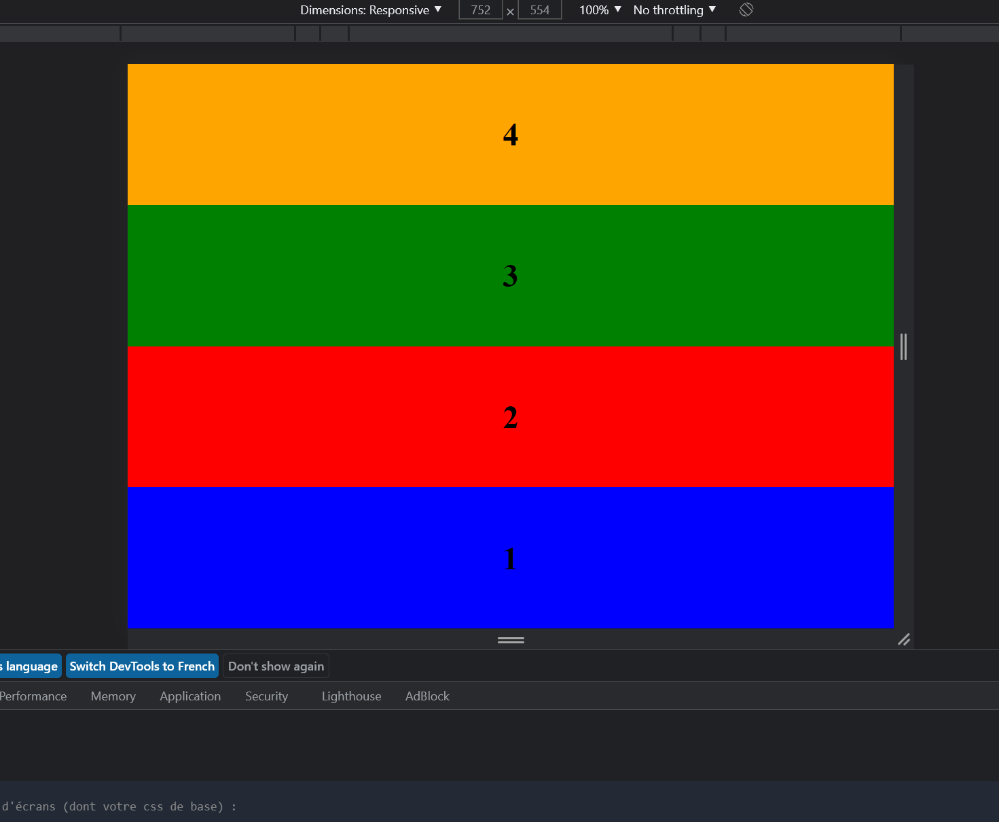
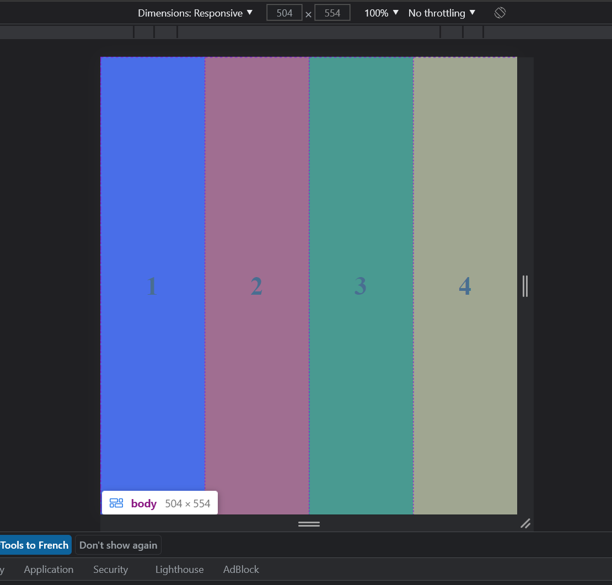

# Exercices-Responsive

Le but des différents exercices étaient de rendre un site web html responsive en utilisant media quieries.

Résultats Exo 3:

Au dela de 800px:

Entre 800px et 500px :

En dessous de 500px :

